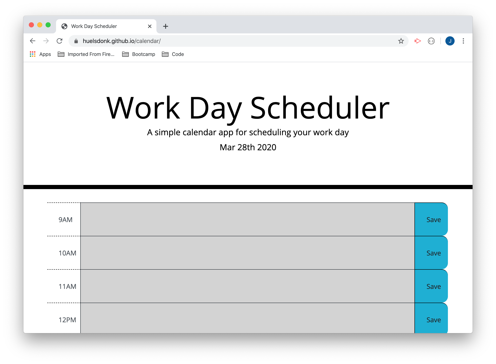

# A Calendar App

This app allows the user to add events each hour during the work day. The events can be saved to local storage via the attached button and will be available the next time the app is opened.

The date is displayed at the top of the page, and the event fields are dynamically updated to show past, current, and future hours. Past hours are grey, the current hour displays red, and the future is green.

Hope you find it helpful. The working app is right [here.](https://huelsdonk.github.io/calendar/)

